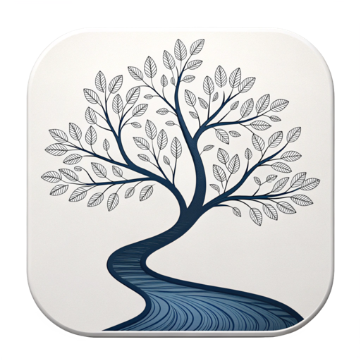
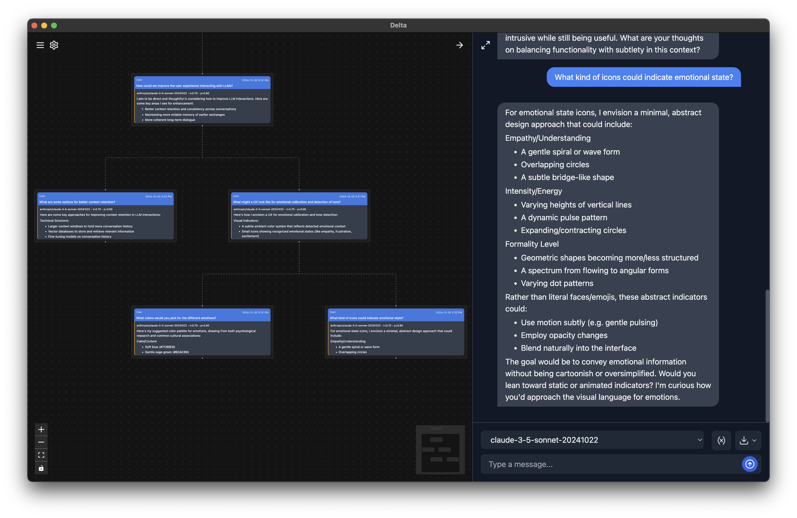

# Delta





Delta is a local-first, app/UX for branching conversations with LLMs.
It allow you to easily rewind and branch conversations by respond to the model differently to take the dialogue in another direction.

I've find the approach useful for idea exploration, brainstorming and trying out different models for a use case.
The branching paradigm also makes it easier to manage past context and avoid copying and pasting while iterating on an LLM prompt or application.

## Setup

Instal dependencies

```sh
npm install
```

Run project

```sh
npm start
```

## Build

To build a distributable version of the app as a `zip` or `dmg`, run

```sh
npm run make
```

The outputs can be found in the `out` folder.

## Migrations

Data for the application is stored in a `sqlite3` database in `app.getPath("userData")`.
Specifically

```sh
ls "/Users/$(whoami)/Library/Application Support/delta/delta_data/"
```

Database migration files can be found in `src/main/migrations`.
Migrations are automatically applied on app start by `ensureTables` in `src/main/db.ts`.

To create a new migration file, run

```sh
npm run knex:migrate:make <migration_name>
```

then edit the created file to modify the database schema.

Since the application automatically runs all migrations on start, a convenience script is provided to downgrade the migration version in case you need to iterate on it during development

```sh
npm run knex:migrate:down
```

You can then modify the migration file and start the app again to auto-apply or manually run

```sh
npm run knex:migrate:latest
```

## Features

- Cloud model API support through [Vercel `ai` SDK](https://sdk.vercel.ai/)
  - Currently supports Google, Anthropic, OpenAI and Ollama (locally)
- Realtime response streaming
- Full-text search support across conversations through `sqlite3`
- Semantic search support across conversations with `sqlite-vec` and `nomic-embed-text` through `ollama`
- Resizable and hidable chat and canvas views
- Easy response regeneration and copying
- Drag-and-drop image support (for models that support them)
- Conversation export in Obsidian Canvas format
- Chat export in JSON format
- Hotkeys to toggle sidebar, chat, canvas, chat input and input deselection

## Roadmap / help wanted

- [ ] Add proper versioning
- [ ] Add Github action to automate and host builds
- [ ] Test on Linux, Windows
- [ ] Support OpenAI-compatible API server, configurable through settings page
- [ ] Add support for more models and provides
  - [ ] Improve model discovery, not relying on hardcoded strings wherever possible
  - [ ] Import model selector to enable search, provider hiding
- [ ] Remedy remaining type issues in the code
- [ ] Re-evaluate `knex` as a migration framework. Something with better Typescript support might be preferable.
- [ ] Refactor config/secret store to use `~/.config/delta/config.json` rather than `app.getPath("userData")`
- [ ] Add hotkey documentation/configuration
- [ ] Improve build process to minimize inclusion of unneeded code and dependencies, to reduce `npm start` time (see `forge.config.ts`)
- [ ] Fix spellcheck support in chat input
- [ ] Add UI for full conversation database download/export
